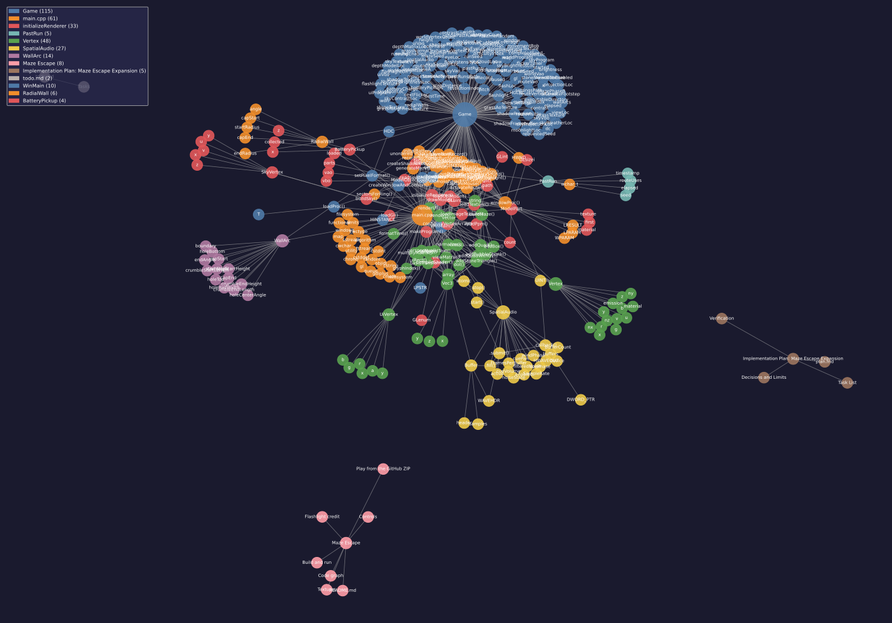

# Maze Escape

A first-person OpenGL maze game built directly on Win32/WGL. Each new run generates a connected maze with a circular starting chamber and gently irregular outer rings. A randomized depth-first search builds a spanning tree over polar cells, leaving exactly one route from the center to the single exit. The maze is converted to a fine grid so its walls look smoothly curved in the 3D view.

## Code graph

This graph maps 209 code and documentation symbols and 358 extracted relationships across 10 communities. The [interactive graph](graphify-out/graph.html) and [graph data](graphify-out/graph.json) are also included.



## Build and run

Use a Windows C++ compiler and CMake:

```powershell
cmake -S . -B build
cmake --build build --config Release
```

Run `build\Release\MazeEscape.exe` with a Visual Studio generator, or `build\MazeEscape.exe` with a single-configuration generator. CMake copies the textures and flashlight model next to the executable.

## Play from the GitHub ZIP

Download and extract the repository ZIP, then double-click `MazeEscape.exe` in the extracted folder. Keep the `assets` folder beside the executable; it contains the textures and flashlight model. No build tools are needed.

## Controls

- **Enter / Space / Click**: start
- **W / S**: move forward/back
- **A / D**: strafe
- **Shift**: sprint
- **Mouse**: look around
- **O**: reveal the route for one second (15-second cooldown)
- **Esc**: pause; Esc again returns to the title screen
- **S**: open settings from the title screen or pause menu
- **Settings**: Up/Down selects; Left/Right changes; Enter toggles sound or Back
- **Click**: start or resume
- **R**: restart after escaping

Settings include window resolution (960x600, 1280x800, 1600x900, or fullscreen), brightness, contrast, and sound on/off. Choices are saved to `settings.ini` beside the executable. The game uses a first-person view with a flashlight. The brightness and contrast controls range from 50 to 150 percent.

The O skill runs A* on the walkable grid and briefly draws the shortest route to the exit. The game maze is a spanning tree, so there is only one corridor route to solve; A* efficiently finds that route from the player's current position. The flashlight casts filtered real-time shadows. The stone walls and forest floor use bundled 2K PBR maps for color, normal detail, roughness, and ambient occlusion, with scattered moss on the stone. The outer rings vary in shape on each map while the starting chamber remains circular. Selected wall ends have chipped silhouettes and small fallen stones; they are decorative and stay out of the route. A few narrow eye-level gaps let you glimpse adjacent corridors; they remain solid for movement. Corridors stay wide enough for comfortable movement. The timer stops when you escape. Footsteps play as you move, with cues for the menu, route reveal, and escape.

## Textures

The floor uses the 2K texture set from [Poly Haven Forest Ground 01](https://polyhaven.com/a/forrest_ground_01), and the walls use the 2K set from [Poly Haven Stone Wall 05](https://polyhaven.com/a/stone_wall_05). Both are CC0 assets and include diffuse, normal, roughness, and ambient-occlusion maps. The night sky is from [Poly Haven Qwantani Moon Noon (Pure Sky)](https://polyhaven.com/a/qwantani_moon_noon_puresky). The assets are bundled locally; the game does not need an internet connection to load them.

## Flashlight credit

"Old Flashlight" (https://skfb.ly/6zFGo) by Blender3D is licensed under Creative Commons Attribution (http://creativecommons.org/licenses/by/4.0/).
